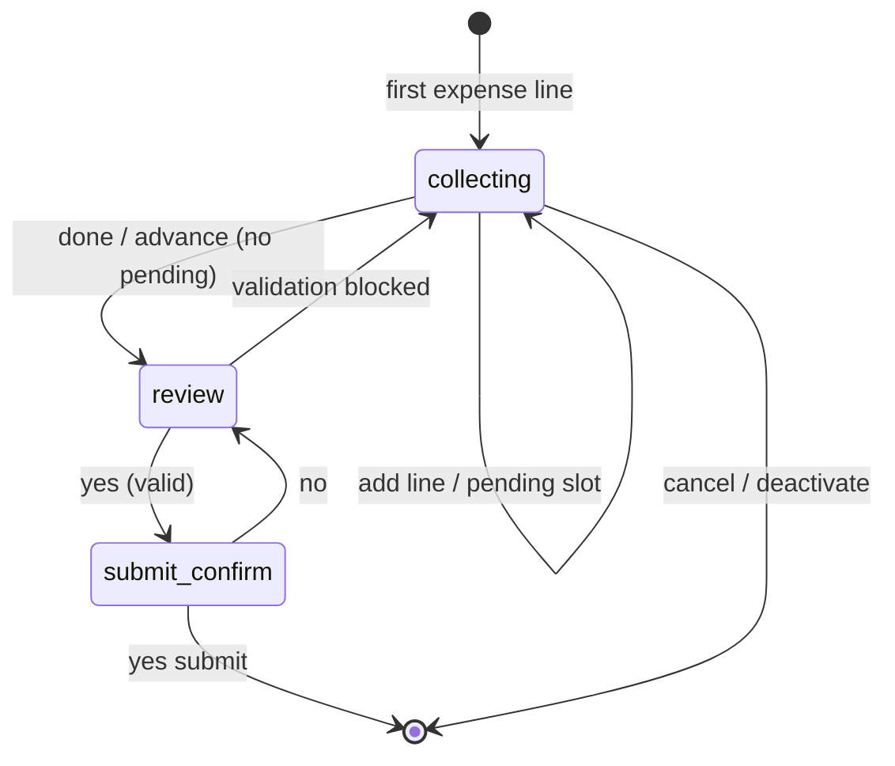
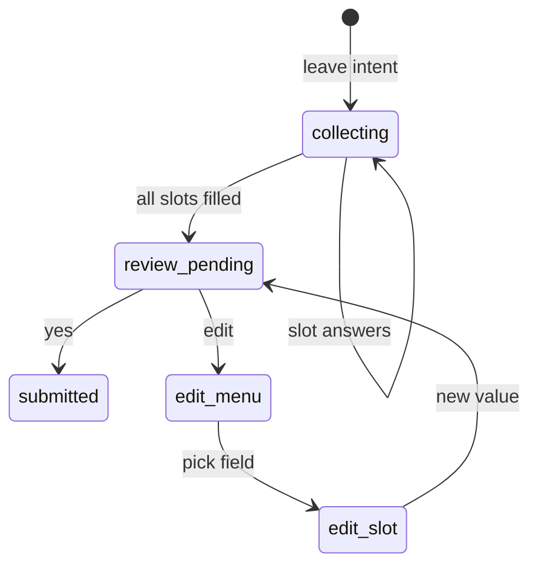

# Workflow State Machines (P3)

Deterministic stage transitions for leave and expense wizards. Tests live in
`tests/test_workflow_state_transitions.py`.

## Expense wizard

| Stage | User signal | Next stage |
|-------|-------------|------------|
| `collecting` | new lines / slot answers | `collecting` |
| `collecting` | done / finish (valid draft) | `review` |
| `review` | yes (valid) | `submit_confirm` |
| `review` | edit / correction | `review` |
| `submit_confirm` | yes | submitted (inactive) |
| `submit_confirm` | no | `review` |

Pending sub-steps during `collecting`: `category`, `from_to`, `clarify`.

## Leave wizard

| State | User signal | Next |
|-------|-------------|------|
| collecting | slot answer | collecting / review_pending |
| review_pending | yes | submitted |
| review_pending | edit | edit_menu |
| edit_menu | field name | edit_slot |
| edit_slot | new value | review_pending |

## Cross-workflow suspend

- Active leave + expense claim → `suspended_leave` snapshot, expense active.
- Active expense + leave claim → `suspended_expense` snapshot, leave active.
- Resume commands restore the parked snapshot.

See `workflow_suspend.py` and `tests/test_workflow_context_switch.py`.
